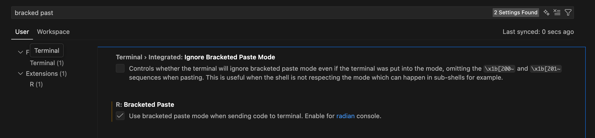

# Basic Mathematical Operations in R
- Chinese version reference: https://www.math.pku.edu.cn/teachers/lidf/docs/Rbook/html/_Rbook/intro-example.html

Basic arithmetic operations can be performed directly in R. Here are some examples:
```{r basic-math, results='hide'}
5 + (2.3 - 1.125) * 3.2 / 1.1 + 1.23E3
sqrt(6.25)
exp(1)
log10(10000)
log(exp(1))
sin(pi / 2)
cos(0)
```

The following functions are commonly used for statistical distributions in R:
`dnorm()`, `pnorm()`, `qnorm()`, `rnorm()` for normal distribution, get density, cumulative probability, quantile, and random samples respectively.
```{r distributions, results='hide'}
dnorm(1.96)
pnorm(1.96)
qnorm(0.975)
rnorm(5)
qt(0.975, df = 10)
```

# Using the Pipe Operator
`|>` is the native pipe operator, which is helpful for chaining functions together in a readable way.

The following two lines of code are equivalent: the first line use the pipe operator first to pass `1` to `exp()`, then pass the result to `log()`. The second line directly computes `log(exp(1))`.
```{r pipe-operator, results='hide'}
1 |>
  exp() |>
  log()
log(exp(1)) # equalize to the above line
```


You can also define your own functions and use the pipe operator:

```{r custom_function_pipe}
frat <- function(x) {
  (1 + x + 2 * x^2) / (1 + 3 * x + 2 * x^2 + x^3)
}
# simple test
frat(1)
```

If you face error when run chunk with multiple lines as followed:
```
r$> }
Error: unexpected '}' in "}"
```

try to enable the option `R:Bracketed Paste` in VSCode settings.


# output
Use `print()` to display the result of an expression in R markdown chunks.
Also `cat()` can be used to concatenate and print strings.
```{r output_example}
result <- sqrt(16)
print(result) # prints 4
cat("The square root of 16 is", result, "\n")
# prints "The square root of 16 is 4"
```

# vector
Vectors are one-dimensional arrays that can hold numeric, character, or logical data. You can create a vector using the `c()` function:

```{r vector_example}
# Create a numeric vector
num_vector <- c(1, 2, 3, 4, 5)

continous_vector <- seq(1, 10, by = 0.5) # from 1 to 10 with step size 0.5

quick_vector <- 1:10 # from 1 to 10 with step size 1
print(num_vector)
print(continous_vector)
print(quick_vector)
```

the calculation between vectors is element-wise:
```{r vector_operations}
a <- c(1, 2, 3)
b <- c(4, 5, 6)
sum_vector <- a + b
prod_vector <- a * b
print(sum_vector) # prints c(5, 7, 9)
print(prod_vector) # prints c(4, 10, 18)

constant <- 2
scaled_vector <- a * constant
print(scaled_vector) # prints c(2, 4, 6)
```


# Read data from CSV file and Summarization

First, we need to install and load the `readr` package to read CSV files. The `read_csv()` function from this package is used to read CSV files into R as data frames.

Run the following code chunk to automatically detect whether the `readr` package is installed, and install it if not. Then, it reads a CSV file named `taxsamp_english.csv` located in the `data` folder, specifying the UTF-8 encoding to properly handle any special characters. Finally, it prints the first few rows of the data frame using the `head()` function.
```{r read_csv_example, results='hide'}
if (!requireNamespace("readr", quietly = TRUE)) {
  install.packages("readr")
}

library(readr)
tax_data <- read_csv(
  "./data/taxsamp_english.csv",
  locale = locale(encoding = "utf-8")
)

print(head(tax_data))
```

Sometimes, the Chinese characters may not display correctly in certain environments. If you encounter this issue, change the encoding to others like `GBK` or `BIG5` as needed.
```{r read_csv_alternative, results='hide'}
tax_data_chinese <- readr::read_csv(
  "./data/taxsamp.csv",
  locale = readr::locale(encoding = "GB18030")
)
print(head(tax_data_chinese))
```

Next, we can use `table()` function to summarize the frequency of values in a specific column, and `summary()` function to get a summary of statistics for each column in the data frame.


```{r summarize_data}
# calclulate the frequency of values in the "Levy Method" column
# show frequency of different levy methods in the first 10 rows
table(tax_data[1:10, c("Levy Method")])

# The following two lines are equivalent
table(tax_data[["Levy Method"]], tax_data[["Filing Channel"]])
table(tax_data[, c("Levy Method", "Filing Channel")])

# make it more readable
knitr::kable(table(tax_data[, c("Levy Method", "Filing Channel")]))
# summarize data with numerical data type
summary(tax_data)
```


Other type of aggregation can be calclulated:

```{r aggregate_data}
mean(tax_data$Turnover) # $ is a shortcut to access columns in data frame
sd(tax_data$Turnover)
```


